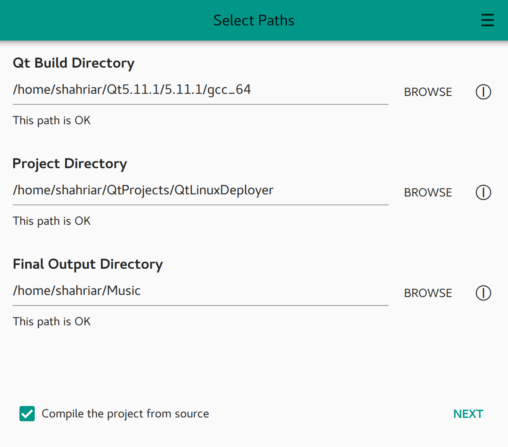
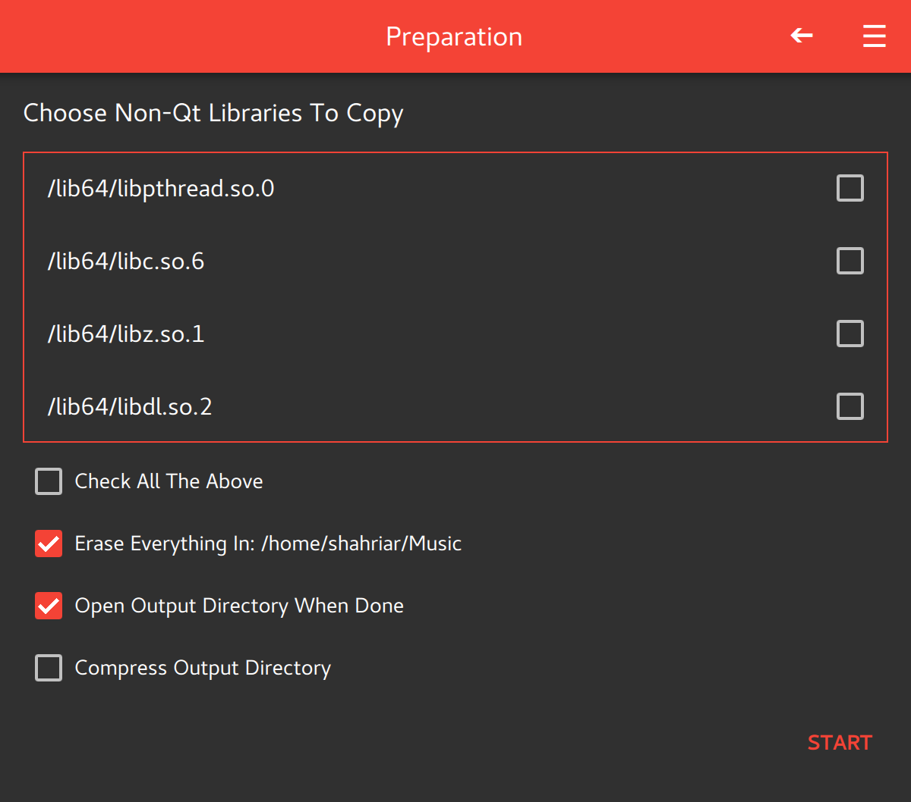

# QLD

A graphical tool to make the deploying of Qt quick applications on linux platform faster.

# Running the project
You can download and run the [latest release]() on your linux system, or if you want to compile the project from source you can see the Building from Source section.

# Building from Source
If you are using qtcreator you can just load the project inside qtcreator and run the project from there. If you are not using qtcreator make sure you have qt and qmake installed on your system and run the commands below inside the project directory:

``` shell
$ qmake QtLinuxDeployer2.pro
$ make
```

# License
This project is published under GPL v3.0 license. See the [license file](LICENSE) for more details.

# Contributing
If there are any issues or bugs you can report them on the issues page and start the project if you like it.

# Screenshots
You can see some screenshots here


